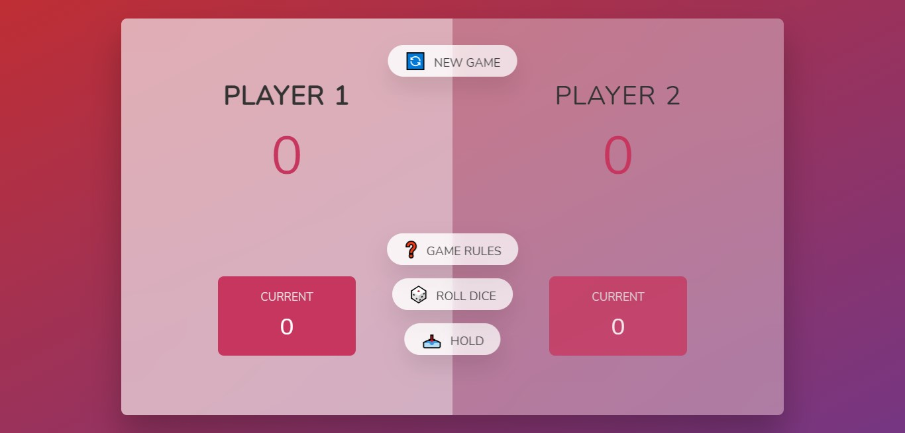
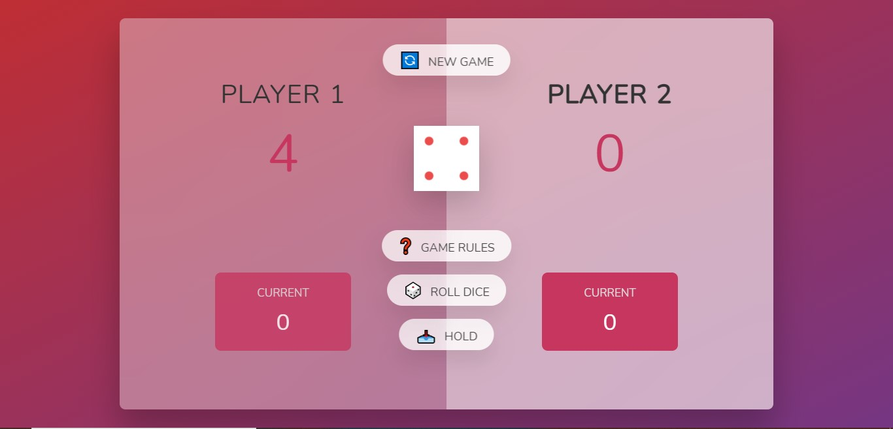
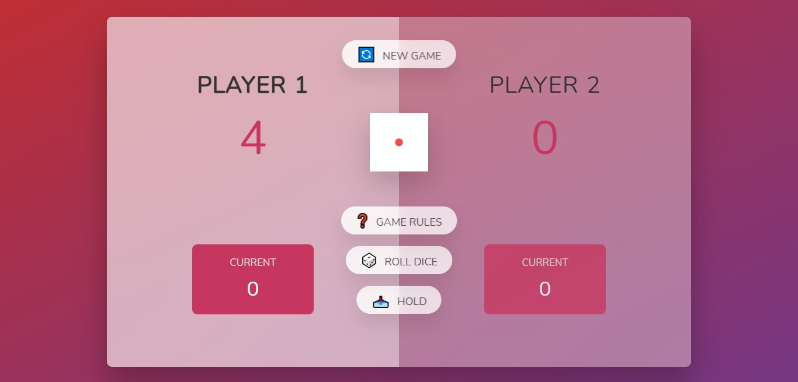
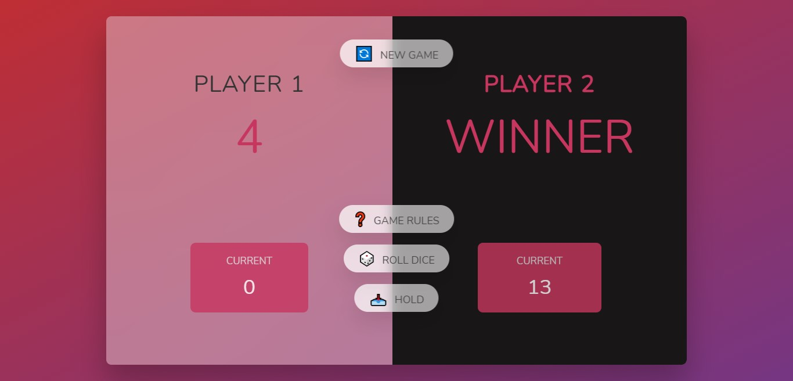

# Dice Game

A simple HTML, CSS, and JavaScript-based Dice Game. The game is designed for two players, where players take turns rolling a dice to accumulate points, and the first player to reach 50 points wins the game.

## Features

* **Player 1 always has an advantage of rolling the dice first.**
* **Each dice roll will add your score to the current score.**
* **The "Hold" button shifts your current score to the final score and changes the turn.**
* **If the dice roll gives a 1, your current score becomes zero, and the turn changes.**
* **The player who reaches 50 first will win the game.**

## Game Instructions

1. **Player 1 always has an advantage of rolling the dice first.** 

2. **Each dice roll will add your score to the current score.** 

3. **Hold button shifts all your current score to final score and changes turn.** 

4. **If dice roll gives 1, your current score becomes zero and turn changes.** 

5. **Player who reaches 50 first will win the game.** 

## Installation

1. Clone the repository to your local machine using:

   ```bash
   git clone https://github.com/rajat2229/Dice-Game-main.git
   ```

2. Navigate to the project directory:

   ```bash
   cd Dice-Game-main
   ```

3. Open `index.html` in your preferred web browser to start playing the game.

## File Structure

```bash
Dice-Game-main/
│
├── index.html        # Main HTML file containing the game layout
├── style.css         # Styles for the game's visual design
├── script.js         # JavaScript code that handles game logic and interactivity
└── README.md         # This file
```

## Usage

* **Roll Dice:** Click the "🎲 Roll dice" button to roll the dice and accumulate points.
* **Hold:** Click the "📥 Hold" button to transfer your current points to the final score and end your turn.
* **New Game:** Click the "🔄 New game" button to reset the game and start fresh.
* **Game Rules:** Click the "❓ Game Rules" button to view the rules of the game in a modal.

## Contributing

Feel free to fork the repository and submit pull requests for any improvements or bug fixes.

## License

This project is licensed under the MIT License - see the [LICENSE](LICENSE) file for details.


